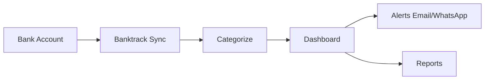

## Overview

Banktrack empowers you to manage your business finances with real-time visibility into all expenses and income. Categorize transactions automatically, visualize trends across dashboards, and access data via your preferred channels like email or WhatsApp. Over 1000 companies in Spain rely on Banktrack for streamlined treasury management without external accountants. Start with a free trial to experience these core capabilities.

<Columns cols={3}>
  <Card title="Real-time Tracking" icon="zap" href="/docs/tracking">
    Monitor every financial movement instantly as it happens.
  </Card>
  <Card title="Smart Categorization" icon="categories" href="/docs/categorization">
    Automatically sort expenses and income for clear insights.
  </Card>
  <Card title="Multi-channel Access" icon="smartphone" href="/docs/access">
    Get updates via email, WhatsApp, or your custom channel.
  </Card>
</Columns>

## Real-time Expense and Income Tracking

Track all financial activities in real time to stay ahead of your cash flow. Banktrack pulls data from your bank accounts and categorizes inflows and outflows automatically.

<Steps>
  <Step title="Connect Accounts" icon="link">
    Link your bank APIs securely. Banktrack supports major Spanish banks like BBVA and Santander.
  </Step>
  <Step title="Enable Tracking" icon="play">
    Activate real-time sync in your dashboard settings.
  </Step>
  <Step title="View Dashboard" icon="activity">
    Watch transactions update live with color-coded alerts for large expenses.
  </Step>
</Steps>

<Callout kind="tip">
  Set custom thresholds, such as alerting on expenses `{>500€}` to control spending proactively.
</Callout>

## Data Categorization and Visualization

Banktrack uses AI to categorize transactions into buckets like "Salaries", "Marketing", or "Utilities". Visualize data through interactive charts and reports.

```javascript
// Example: Fetch categorized data via Banktrack API
const response = await fetch('https://api.banktrack.com/v1/transactions', {
  headers: { 'Authorization': 'Bearer YOUR_API_KEY' }
});
const data = await response.json();
console.log(data.categories); // { salaries: 15000, marketing: 2500 }
```

<Columns cols={2}>
  <Card title="Pie Charts" icon="pie-chart">
    See expense breakdowns at a glance.
  </Card>
  <Card title="Trend Lines" icon="trending-up">
    Track monthly income growth over time.
  </Card>
</Columns>

## Multi-channel Access

Access your financial data anywhere with Banktrack's flexible notifications.

<Tabs>
  <Tab title="Email" icon="mail">
    Receive daily summaries with categorized totals.
    
    ```
    Subject: Banktrack Daily Report
    Income: 5,200€
    Expenses: 3,100€
    Net: +2,100€
    ```
  </Tab>
  <Tab title="WhatsApp" icon="message-circle">
    Get instant alerts for high-value transactions.
    
    <Image
      src="https://example.com/whatsapp-alert.png"
      alt="WhatsApp notification showing a 1,000€ expense alert"
      width="300"
      height="500"
    />
  </Tab>
  <Tab title="Custom Webhook" icon="webhook">
    Integrate with your tools using webhooks.
    
    <CodeGroup tabs="JavaScript,cURL">
```javascript
// Listen for webhook events
app.post('/banktrack-webhook', (req, res) => {
  console.log('New transaction:', req.body.amount, req.body.category);
});
```
```bash
curl -X POST https://api.banktrack.com/v1/webhooks \
  -H "Authorization: Bearer YOUR_API_KEY" \
  -d '{"url": "https://your-app.com/webhook"}'
```
    </CodeGroup>
  </Tab>
</Tabs>

## Reporting and Insights

Generate custom reports for deeper analysis. Export data in CSV or PDF for your team.

<Expandable title="Advanced Reporting Options" default-open="false">
  Schedule weekly insights emails or download detailed ledgers. Filter by date range, category, or amount to uncover patterns like seasonal spending spikes.
</Expandable>

| Feature | Benefit | Example Use Case |
|---------|---------|------------------|
| Custom Filters | Precise data slicing | View Q1 marketing spend only |
| Export Options | Easy sharing | Send PDF reports to board |
| AI Insights | Predictive alerts | Forecast cash flow shortages |



Banktrack's core features deliver complete financial control, saving you time and reducing errors. Try it free today to transform your treasury management.