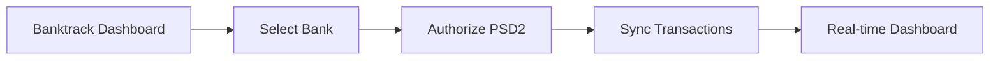

## Overview

Banktrack integrates seamlessly with email, WhatsApp, bank accounts, and custom access controls. Set up these connections to receive real-time financial alerts and automate your treasury management. Start with the quick links below to jump to your preferred integration.

<Columns cols={2}>
  <Card title="Email & WhatsApp" icon="mail" href="#email-notifications">
    Configure notifications for instant updates on expenses and income.
  </Card>
  <Card title="Bank Accounts" icon="banknote" href="#linking-bank-accounts">
    Link your accounts for automatic transaction tracking.
  </Card>
  <Card title="Access Preferences" icon="settings" href="#customizing-access-preferences">
    Tailor permissions and delivery channels.
  </Card>
</Columns>

<Callout kind="tip">
  Test each integration in Banktrack's sandbox mode before going live to avoid disruptions.
</Callout>

## Email Notifications

Set up email alerts to monitor categorized expenses and income. Banktrack sends daily summaries or real-time notifications based on your thresholds.

<Steps>
  <Step title="Access Integrations Dashboard" icon="settings">
    Log in to your Banktrack dashboard. Navigate to **Settings > Integrations > Email**.
  </Step>
  <Step title="Add Email Provider" icon="plus">
    Select your provider (Gmail, Outlook, or custom SMTP). Enter server details:

    ```yaml
    smtp-server: smtp.yourprovider.com
    port: 587
    username: your-email@company.com
    password: YOUR_APP_PASSWORD
    ```
  </Step>
  <Step title="Configure Rules" icon="sliders">
    Set thresholds like `>€5000` for high-value transactions. Choose categories: **Expenses > Travel**, **Income > Salaries**.
  </Step>
  <Step title="Test and Activate" icon="check-circle">
    Send a test email. Toggle **Active** to enable.
  </Step>
</Steps>

## WhatsApp Integration

Connect WhatsApp Business API for mobile alerts. Use the setup below, tailored to your platform.

<Tabs>
  <Tab title="Meta Business Suite" icon="smartphone">
    <Steps>
      <Step title="Get API Credentials">
        In Meta Business Suite, create an app and note the `{PHONE_NUMBER_ID}` and `{ACCESS_TOKEN}`.
      </Step>
      <Step title="Enter in Banktrack">
        Paste into Banktrack: **Integrations > WhatsApp > Meta**.

        ```javascript
        const config = {
          phoneNumberId: "123456789012345",
          accessToken: "YOUR_WHATSAPP_TOKEN"
        };
        ```
      </Step>
    </Steps>
  </Tab>
  <Tab title="Twilio Sandbox" icon="code">
    Sign up for Twilio WhatsApp Sandbox. Use these details:

    ```bash
    curl -X POST https://api.twilio.com/2010-04-01/Accounts/YOUR_ACCOUNT_SID/Messages.json \
    --data-urlencode "From=whatsapp:+14155238886" \
    --data-urlencode "To=whatsapp:+YOUR_NUMBER" \
    --data-urlencode "Body=Test from Banktrack"
    ```
  </Tab>
</Tabs>

## Linking Bank Accounts

Securely link banks for real-time transaction syncing. Banktrack supports major Spanish banks like BBVA, Santander, and CaixaBank.

<Steps>
  <Step title="Select Bank" icon="banknote">
    Go to **Integrations > Banks**. Choose your bank from the list.
  </Step>
  <Step title="Authorize Access" icon="shield">
    Use Open Banking (PSD2). Scan the QR code or enter credentials securely—no passwords stored.
  </Step>
  <Step title="Map Categories" icon="tag">
    Assign transactions: **IBAN ES9121000418450200051330** to **Expenses > Utilities**.
  </Step>
  <Step title="Verify Sync" icon="refresh-cw">
    Check the first sync. Transactions appear in `<24h`.
  </Step>
</Steps>



## Customizing Access Preferences

Tailor who receives what data. Use roles for teams.

| Preference | Options | Default |
|------------|---------|---------|
| Delivery Channel | Email, WhatsApp, Slack | Email |
| Role Permissions | View Only, Edit Categories, Full Admin | View Only |
| Threshold Alerts | `<€100`, `>€10000`, Custom | None |
| Data Retention | 30 days, 1 year, Unlimited | 1 year |

<Expandable title="Advanced Role Configuration" default-open="false">

Define roles via JSON config:

```json
{
  "roles": {
    "viewer": ["read:transactions", "view:reports"],
    "editor": ["read:transactions", "update:categories", "export:csv"]
  }
}
```

Upload in **Settings > Access > Roles**.

</Expandable>

<Callout kind="success">
  All integrations use end-to-end encryption. Review audit logs in **Security > Logs**.
</Callout>