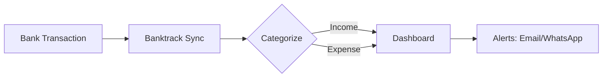

## Overview

Banktrack provides treasury management software that tracks your business finances in real-time. You gain a single platform to visualize all expenses and income, automatically categorized for easy analysis. Access insights via email, WhatsApp, or your preferred channels. Over 1000 companies and holdings in Spain rely on Banktrack to manage cash flow without external accountants. Start with a free trial today.

<Columns cols={3}>
  <Card title="Real-Time Tracking" icon="zap" href="/docs/tracking">
    Monitor every transaction as it happens across all bank accounts.
  </Card>
  <Card title="Automatic Categorization" icon="tags" href="/docs/categorization">
    AI-powered rules sort expenses and income instantly.
  </Card>
  <Card title="Multi-Channel Alerts" icon="bell" href="/docs/alerts">
    Receive notifications on email, WhatsApp, or Slack.
  </Card>
</Columns>

## Key Benefits for Businesses

Banktrack simplifies financial oversight. You save time on manual reconciliation and gain actionable insights into cash flow. Key advantages include:

| Benefit | Description | Impact |
|---------|-------------|--------|
| Time Savings | Automate tracking and reporting | Reduce accounting hours by 80% |
| Cost Reduction | Eliminate external services | Save thousands annually |
| Real-Time Visibility | Instant dashboards and alerts | Make faster decisions |
| Scalability | Handles multiple accounts | Grow without complexity |

<Callout kind="success">
  Over 1000 Spanish businesses use Banktrack to streamline treasury operations.
</Callout>

## Who Should Use Banktrack

Target users include SMEs, holdings, and startups managing multiple bank accounts. You benefit if you:

- Track expenses across banks manually
- Need categorized financial reports
- Want mobile-friendly notifications

<Tabs>
  <Tab title="SMEs" icon="building">
    Centralize finances for small teams without dedicated accountants.
  </Tab>
  <Tab title="Holdings" icon="layers">
    Aggregate data from subsidiaries in one dashboard.
  </Tab>
  <Tab title="Startups" icon="sparkles">
    Monitor burn rate and runway with real-time metrics.
  </Tab>
</Tabs>

## Getting Started

Set up Banktrack in minutes. Follow these steps to connect your accounts and start tracking.

<Steps>
  <Step title="Sign Up" icon="user-plus">
    Create a free account at `https://app.banktrack.com/register`.
  </Step>
  <Step title="Connect Banks" icon="link">
    Authorize your bank accounts via secure OAuth.
  </Step>
  <Step title="Configure Alerts" icon="bell">
    Set categories and notification channels.
  </Step>
  <Step title="Review Dashboard" icon="bar-chart">
    Explore your first real-time report.
  </Step>
</Steps>

Integrate programmatically with webhooks for custom workflows.

<CodeGroup tabs="Node.js,Python">
  ```javascript
  const express = require('express');
  const app = express();

  app.post('/banktrack-webhook', express.raw({type: 'application/json'}), (req, res) => {
    const transaction = JSON.parse(req.body);
    console.log('New transaction:', transaction.amount, transaction.category);
    res.status(200).send('OK');
  });

  app.listen(3000);
  ```
  ```python
  from flask import Flask, request

  app = Flask(__name__)

  @app.route('/banktrack-webhook', methods=['POST'])
  def webhook():
      transaction = request.json
      print(f"New transaction: {transaction['amount']} - {transaction['category']}")
      return 'OK', 200

  if __name__ == '__main__':
      app.run(port=3000)
  ```
</CodeGroup>



<Expandable title="Frequently Asked Questions" default-open="false">

### Is Banktrack secure?
Yes, Banktrack uses bank-level encryption and read-only access.

### What banks are supported?
All major Spanish banks including BBVA, Santander, and CaixaBank.

### Can I cancel anytime?
Switch to free trial or paid plans with monthly billing—no long-term commitments.

</Expandable>

<Callout kind="tip">
  Try Banktrack free for 14 days. No credit card required.
</Callout>